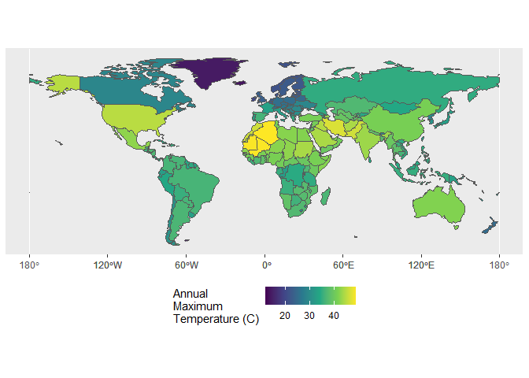

Case Study 06
================
Joe Benz
October 12, 2021

``` r
#load libraries & data
library(raster)
```

    ## Loading required package: sp

``` r
library(sp)
library(spData)
```

    ## To access larger datasets in this package, install the spDataLarge
    ## package with: `install.packages('spDataLarge',
    ## repos='https://nowosad.github.io/drat/', type='source')`

``` r
library(tidyverse)
```

    ## -- Attaching packages --------------------------------------- tidyverse 1.3.1 --

    ## v ggplot2 3.3.5     v purrr   0.3.4
    ## v tibble  3.1.4     v dplyr   1.0.7
    ## v tidyr   1.1.3     v stringr 1.4.0
    ## v readr   2.0.1     v forcats 0.5.1

    ## -- Conflicts ------------------------------------------ tidyverse_conflicts() --
    ## x tidyr::extract() masks raster::extract()
    ## x dplyr::filter()  masks stats::filter()
    ## x dplyr::lag()     masks stats::lag()
    ## x dplyr::select()  masks raster::select()

``` r
library(sf)
```

    ## Linking to GEOS 3.9.1, GDAL 3.2.1, PROJ 7.2.1

``` r
data(world)  #load 'world' data from spData package
tmax_monthly <- getData(name = "worldclim", var="tmax", res=10)
```

\#Data Prep

``` r
#prep polygon data
world_sp <- world %>%
  filter(continent != "Antarctica") %>%
  as("Spatial")

#prep climate data
gain(tmax_monthly) <- 0.1

tmax_annual <- tmax_monthly%>%
                  max()
names(tmax_annual) <- "tmax"
```

\#Extract max values

``` r
max_temp <- raster::extract(tmax_annual, world_sp, fun=max, na.rm=T, small=T, sp=T)%>%
  st_as_sf()
```

\#Plot max values

``` r
ggplot(max_temp)+
  geom_sf(aes(fill=tmax))+
  scale_fill_viridis_c(name="Annual\nMaximum\nTemperature (C)")+
  theme(legend.position = 'bottom')
```

<!-- -->

\#Max temperature by continent

``` r
table <- max_temp%>%
  st_set_geometry(NULL) %>%
  group_by(continent) %>%
  select(name_long, continent, tmax) %>%
  top_n(1) %>%
  arrange(desc(tmax))
```

    ## Selecting by tmax

``` r
table
```

    ## # A tibble: 7 x 3
    ## # Groups:   continent [7]
    ##   name_long                           continent                tmax
    ##   <chr>                               <chr>                   <dbl>
    ## 1 Algeria                             Africa                   48.9
    ## 2 Iran                                Asia                     46.7
    ## 3 United States                       North America            44.8
    ## 4 Australia                           Oceania                  41.8
    ## 5 Argentina                           South America            36.5
    ## 6 Spain                               Europe                   36.1
    ## 7 French Southern and Antarctic Lands Seven seas (open ocean)  11.8
